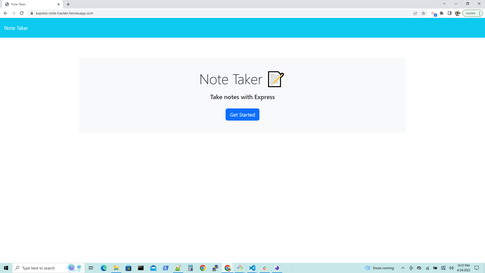
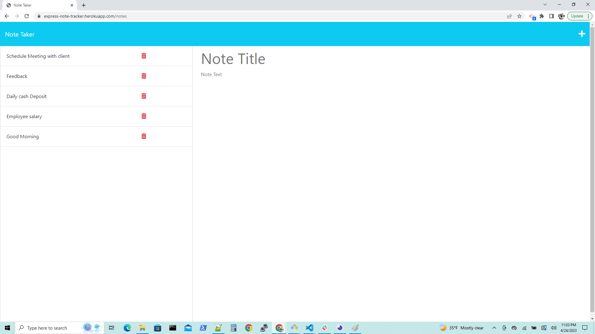
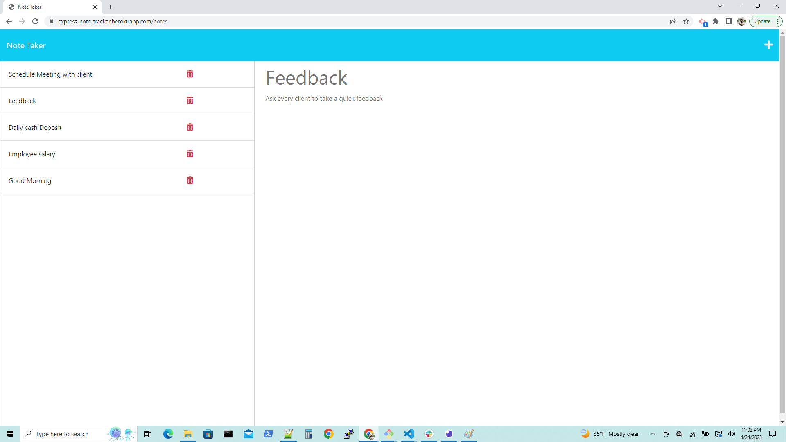
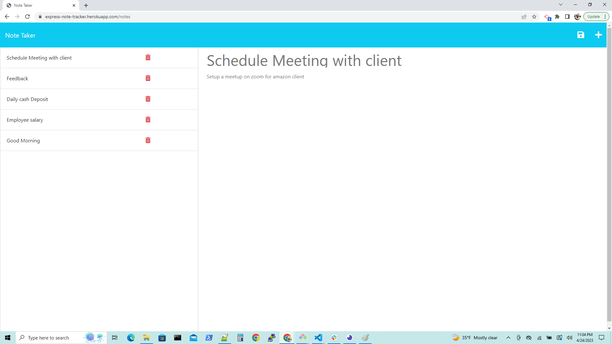
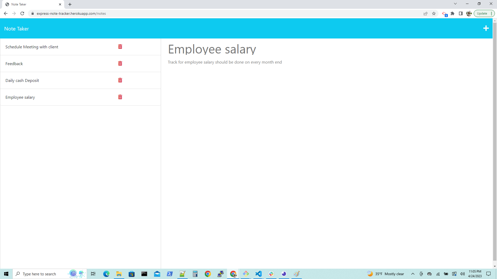

## Expressjs_Note_Taker

## Description

1. Expressjs_Note_Taker is useful for write and save notes. SO THAT, keep track on tasks.

2. When the Expressjs_Note_Taker is open then, it will displayed all the notes link in a landing page.

3. When user navigate to notes pages. Then the list of notes will displayed on left side of the page and if the user want to add new note, then the empty title and empty text fields will displayed on right side of the page.

4. When the user want enter title and text for adding a new note then, the save icon will appears on the top right corner of the page to save the new note.

5. When user want to edit the note which is already present then the user need to click on that particular note and then the empty field will displayed to enter the new text.

6. User can also delete the unwanted note which he don't want to keep in note tracker. By just clicking on delete icon.

## Steps I followed:-

1. Clone starter code from the remote repository "miniature-eureka" to local repository "Expressjs_Note_Taker".

2. Manipulated the code according to the Acceptance Criteria.

3. Created "New Repository" in "GitHub" and named it as, "Expressjs_Note_Takerr".

4. Created directories and files which are uploaded  from local repository to "GitHub".

5. Navigate to "GitHub" repository "Expressjs_Note_Taker" using "Git Bash".

6. Added description, screenshots in  "README"  file.

7. Performed, "add", "commit", "pull", "push", operations on source code.

8.  Deployed and assigned the "URL" to the website.

9. Added screenshot for final website appearance and Git Bash commands.

10. The application's front end was provided. To give the application its CRUD (create, read, update, and delete) functionality, I built the bank end, connected the two, and then deployed the entire application to Heroku.

## URLs:-
Here, you can find the webpage on Heroku.

 Application's Heroku URL:- 

 https://express-note-tracker.herokuapp.com/

Here, you can find the GitHub URL:-

https://github.com/AnujaLawankar/Expressjs_Note_Taker

## Installation

Needed to install npm and nodemon
1. npm install
2. npm install -g nodemon
3. npm install uuid
4. npm start

## Usage

Expressjs_Note_Taker useful for a  small business owner. He can able to write and save notes. SO THAT he can organize his thoughts and keep track of tasks he need to complete

## Assets

The following image demonstrates the web application appearance:
1. Expressjs_Note_Taker web appearance. 

2. Displayed all notes with text in the left side of the web page. And user can add new note with text in the right side of the web page.

3. If user click on left side of note then that note with text will open in the right side of the web page. 

4. If user want to save the text and title then in the top right corner the save icon will appear to save the note with text.

5. User can delete also the note which he don't want to keep in the note tracker. Here, good morning note is deleted as you checkout in the above screenshots.

